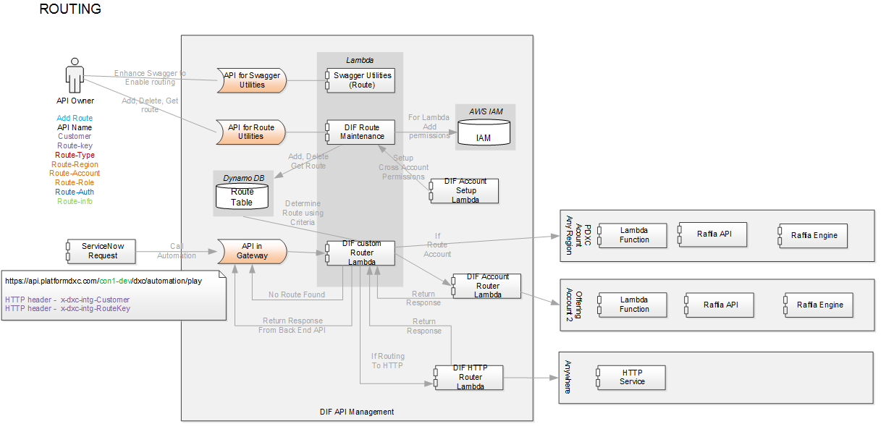

# API Routing for Lambda

The purpose of this document is to give a preview of the capability of the Integration Route capability being added to the AWS API Gateway for Lambda integrations.   The final document will be included in the APIManagementGettingStartedGuide.md once the Route Feature is completed.

The API Gateway will have the capability to route Lambda functions for an API back end.   The Lambda function may or may not be in the same account as the API Gateway. 

The AWS technology used to be able to route to a Lambda function that is not in the same AWS Account as the API Gateway is the **assume role** using STS.  The way this works is that the target Lambda function provides an AWS Role for the Gateway to **assume** and the target Lambda function will also **trust** the API Gateway Route service's AWS Role.

It is important to remember that this role will be giving permissions to an external entity (in another AWS account), so the permissions should be limited.

High level Diagram



# Setup Needed in Target Lambda

[Create Policy for Role to be assumed](#create-policy-for-role-to be assumed)
[Create Role for Api Gateway Routing Utility to assume](#create-role-for-api-gateway-routing-utility-to-assume)
[Give API Gateway Routing Utility Permissions to assume Role](#give-api-gateway-routing-utility-permissions-to-assume-role)

>**Note**  These instructions are ONLY needed when the target Lambda function for the integration is NOT in the same AWS account as the API Gateway
# Steps

## Create Policy for Role to be assumed
In the Target AWS account, setup a policy to ensure that ONLY the specific Lambda function in the Target AWS account can be executed.

This is an important step.  This policy should LIMIT to only invoking a specific Lambda function.

In the Target AWS Account, go into IAM and perform the following steps:
- Select **Policies** from the left pane
- Select **Create policy** button
- Select the **JSON** tab and copy the following JSON

```
{
    "Version": "2012-10-17",
    "Statement": [
        {
            "Sid": "VisualEditor0",
            "Effect": "Allow",
            "Action": [
                "lambda:InvokeFunction",
                "lambda:Invoke"
            ],
            "Resource": "arn:aws:lambda:ca-central-1:890403726045:function:TargetLambda"
        }
    ]
}
```

- Replace the **Resource** with the arn of the Lambda Function in the target AWS account
- Select the **Review policy** button
- Give the policy a Name and select the **Create policy** button

[Back to Top](#api-routing-for-lambda)

## Create Role for Api Gateway Routing Utility to assume

In the previous step, we created a policy that would allow invocation of a single lambda function.

In this step, we will create a role for the API Gateway Routing Utility to assume.  Attache the policy created in the previous step to this role.

In IAM in the Target AWS Account
- Create Role
  -  For this example, the role is named `_DXCLambdaS3`
  -  Select Lambda from the Service selection
  -  Select **Next Permissions** button
  -  Search for and select the policy that was created in the previous step
  -  Select **Next:  Review** button

[Back to Top](#api-routing-for-lambda)

## Give API Gateway Routing Utility Permissions to assume Role
This step will give the API Gateway Routing Utility the permission needed to assume the role that will allow the invoking of the Target AWS Account Lambda.

In IAM in the Target AWS Account
- Update Role (find the role created in the previous step in IAM and select it)
  - Select the **Trust relationships** tab
  - Select **Edit Trust Relationship**
  - Modify the below JSON to fit your needs:
    - The **Principal AWS** value should be the arn used in the **Execution Role** for Lambda function in the **SOURCE** AWS Account.  
 
```

>**Note**  The name of the role will change once the final version of the utility is completed.

{
  "Version": "2012-10-17",
  "Statement": [
    {
      "Effect": "Allow",
      "Principal": {
        "AWS": "arn:aws:iam::890403726045:role/_DXCRouteRole"
      },
      "Action": "sts:AssumeRole"
    }
  ]
}
```

- Paste the modified json into the **Policy Document** area and select the **Update Trust Policy** button


[Back to Top](#api-routing-for-lambda)

