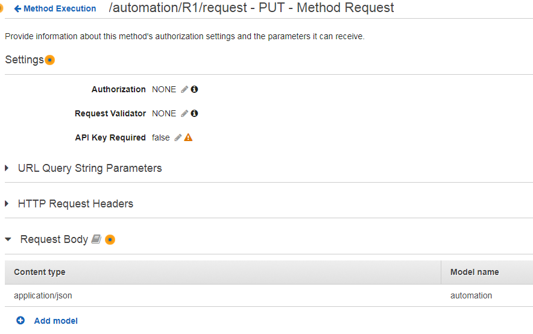
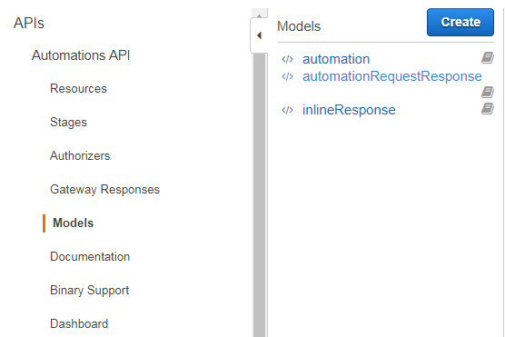
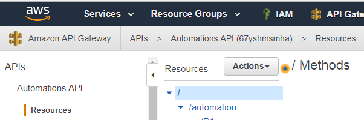

# API Consumer Getting Started Guide

## <a href="#purpose" id="purpose"></a>Purpose
The purpose of this document is to help the Build-a-thon API consumer configure API calls successfully.

- [Retrieve URL and api-key](#retrieve-url-api-key)
- [Calling an API](#calling-api)
  - [Check if API Exists](#published-apis2)
  - [View API Model](#view-model)
  - [Testing APIs](#testing-api)
  - [Call APIs](#call-apis)
  
### <a href="#retrieve-url-api-key" id="retrieve-url-api-key"></a>Retrieve the URL and api-key

The base URL (servername part of the URL) along with the api-key will be documented in Sharepoint [Platform DXC API Gateway api-keys.xlsx](https://dxcportal.sharepoint.com/sites/PlatformDXCEnablement/pdxcintegration/Shared%20Documents/Working%20Folder%20-%20Technical/Platform%20DXC%20API%20Gateway%20api-keys.xlsx).

The usage of the api-key and how to call the API is documented in the next section.

[top](#purpose)

## <a href="#calling-api" id="calling-api"></a>Calling an API


[top](#purpose)

### <a href="#published-apis2" id="published-apis2"></a>Check if API Exists

For Build-A-Thon, the list of APIs and their status is available at the following location
[API Catalog](./README.md)

[top](#purpose)

### <a href="#view-model" id="view-model"></a>View API Model
For Build-A-Thon, the developer portal will be under construction.   The API consumer can view the model through the API-Gateway.  All participants of the Build-A-Thon will have read/execute access within the API Gateway.

https://us-east-2.console.aws.amazon.com/apigateway/home?region=us-east-2#/apis

To determine which model is needed for the request
- Select the name of the API in the left pane
- Select `Resources` option in the left pane under the API hierarchy
- The center pane lists each `method`, select the `method` in the resource path that is to be used
- The right pane displays the flow.  Select the `Method Request` header in the top left box


- Expand the `Request Body`
- View the `Model name` in the expanded list



To view the model in the AWS API Console:

- First select the name of the API
- Select the `model` option in the left pane under the API hierarchy
- The center pane lists each `model` used in the selected API
- Select the model name to see the model definition in the right pane



To determine which model is returned in the response

- Select the name of the API in the left pane
- Select `Resources` option in the left pane under the API hierarchy
- The center pane lists each `method`, select the `method` in the resource path that is to be used
- The right pane displays the flow.  There is no need to select any box, the response model is displayed in the `Method Response` *bottom* left box

[top](#purpose)

### <a href="#testing-api" id="testing-api"></a>Testing APIs

Consumer Portal's `Try-It-Out` button is meant for light testing only. Heavy debugging should be done using developer tools like POSTMAN.  

The primary tool of choice for testing API calls is POSTMAN. POSTMAN facilitates sharing of sample calls to API's between multiple developers.

POSTMAN can be downloaded from https://www.getpostman.com/postman.

[top](#purpose)

### <a href="#call-apis" id="call-apis"></a>Call APIs
For build-a-thon, the consumers should call the published APIs with no authentication, however api-key must be sent along with the UR.

Each API will have a unique api-key which must be passed in as an HTTP header.  The api-key for any api can be found on Sharepoint. The base URL (servername part of the URL) along with the api-key will be documented in Sharepoint https://dxcportal.sharepoint.com/sites/PlatformDXCEnablement/pdxcintegration/Shared%20Documents/Working%20Folder%20-%20Technical/Platform%20DXC%20API%20Gateway%20api-keys.xlsx  

HTTP header name is x-api-key.  Below is a sample format for the HTTP header with a sample value
```
x-api-key:  f4842o4zDk2V3kNeHiwMt12opOywN87F4CbJtzRz
```
<b> COMING SOON - SPECIFICS (this will contain required headers, etc) </b>

[top](#purpose)

### <a href="##debug-logs" id="debug-logs"></a>Debug Logs
For the Build-A-Thon, all deployed APIs will have Cloudwatch with INFO level debugging turned on.

Cloudwatch organizes the logs in "streams" for each API.  The Log Group name contains the specific API name identifier that can be found in the API Gateway Console.

- Access API Gateway Console https://us-east-2.console.aws.amazon.com/apigateway/home?region=us-east-2
- Select the desired API from the list on the left pane.  
- The grey banner is updated to show the breadcrumb trail.  In this trail the unique identifier for the api is displayed after the api name and in parenthesis.
- Copy and paste the value  

In the example displayed below, `67yshmsmha` is the unique identifier.


- Access Cloudwatch https://us-east-2.console.aws.amazon.com/cloudwatch/home?region=us-east-2
- Select `Logs` from the left pane
- In the `Filter`, type `API-Gateway-Execution-Logs_67yshmsmha` - BUT, replace the `67yshmsmha` with the specific unique identifier for the API.  Use the enter key to execute the filter.
- The log groups associated with that API are then listed.   Select the one associated with the specific environment.
- The log streams for that environment are then displayed.  
- Select the log stream.  The resulting display is for a single invocation of the API.  
- Selecting the expand arrows will show message snapshots at different points in the processing of the API call as well as detailed debugging information.

[top](#purpose)
