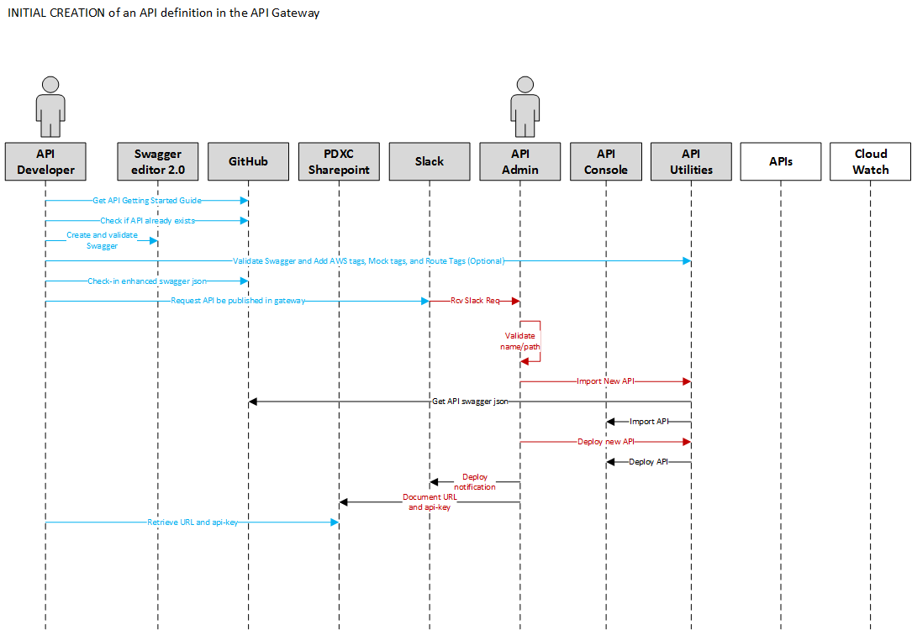
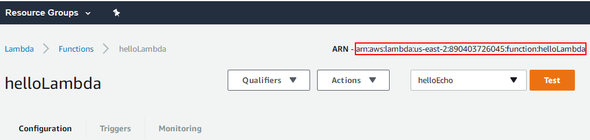
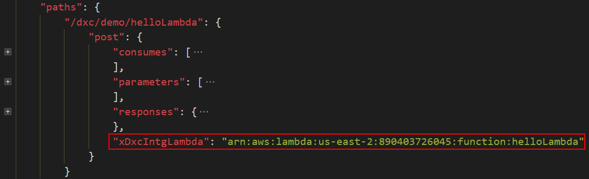
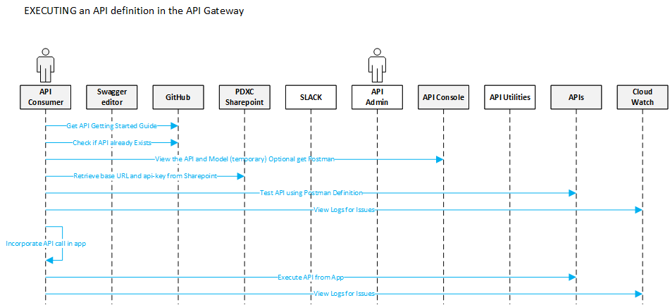
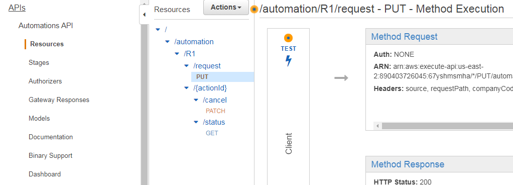
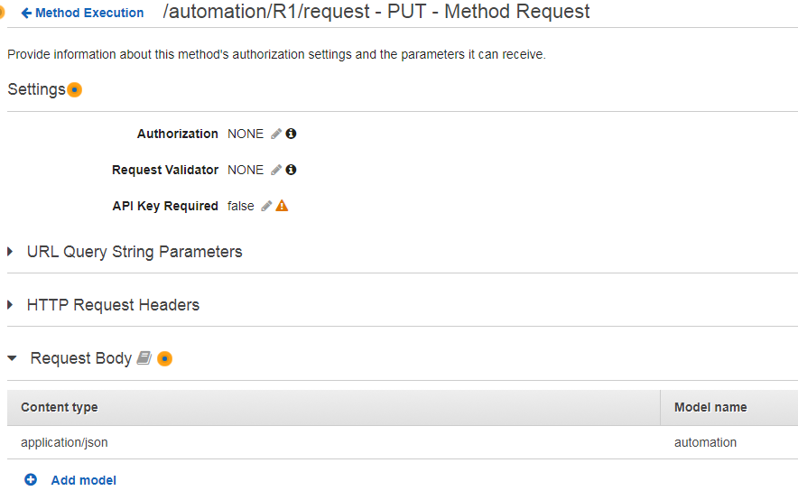
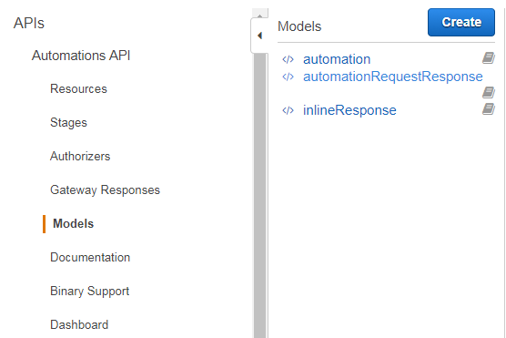
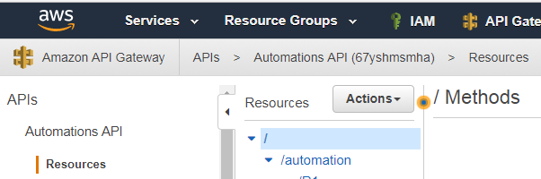
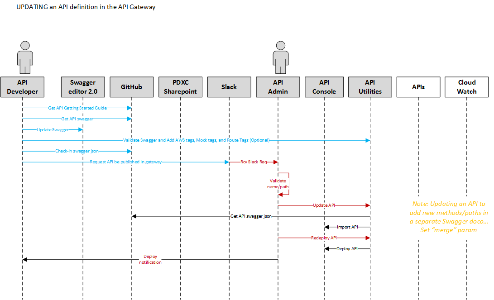

# API Management Getting Started Guide

## <a href="#purpose" id="purpose"></a>Purpose
The purpose of this document is to help the Build-a-thon API developer get a quick start on the process, standards and tools to begin developing, publishing and consuming APIs successfully.

Following are some of the key areas that a developer would need to review initially:

- [API Standards](#api-standards)
- [Build-A-Thon Specifics](#build-a-thon-specifics)
- [Define and Deploy an API](#define-and-deploy)
  - [Check if API Already Exists](#published-apis1)
  - [Create Swagger](#swagger-basics)
  - [Swagger Utility](#swagger-utility)
  - [GITHub API Check-In Standards](#github-standards)
  - [Request an API to be published](#request-api-publish)
  - [Request an API route](#request-api-route)
  - [Retrieve URL and api-key](#retrieve-url-api-key)
- [Calling an API](#calling-api)
  - [Check if API Exists](#published-apis2)
  - [View API Model](#view-model)
  - [Testing APIs](#testing-api)
  - [Call APIs](#call-apis)
  - [Debug Logs](#debug-logs)
- [Updating and Re-Deploying API](#updating-api)


## <a href="#api-standards" id="api-standards"></a>API Standards
PDXC API Standards are located at [API Standards](./API-Standards.md).
These standards are to be used when designing the front end Standard Platform DXC APIs, and should also be adhered to if DXC has control over the definition of back-end APIs; typical when the end point is an in-house developed application.

[top](#purpose)

## <a href="#build-a-thon-specifics" id="build-a-thon-specifics"></a>Build-A-Thon Specifics

During the Build-A-Thon the following will be supported at a minimum
- Authentication to back-end systems will either use Basic Authentication or no Authentication. **Note:** More authentication options like client certificates to come later.
  - For those back-end APIs that need token authentication, this can still be achieved by the consuming application calling through the gateway to get a token, and then sending in the token in the HTTP header for subsequent calls.
  - The API Gateway will forward all HTTP headers, query strings, and resource paths from the API Gateway through to the back-end API.
- Back-end systems will expose their API's using REST/JSON over HTTPS (more integration options like Lambda and EC2 to come later)
- The ability to auto generate MOCK services
- The ability to route

[top](#purpose)

## <a href="#define-and-deploy" id="define-and-deploy"></a>Defining an API and Deploying to the Gateway


[top](#purpose)

### <a href="#published-apis1" id="published-apis1"></a>Check if API Already Exists
For Build-a-thon, the API developer can check if an API already exists by referring to the list of APIs and their status  at the following location
[API Catalog](https://github.dxc.com/Platform-DXC/pdxc-integration/blob/master/apis/readme.md)

[top](#purpose)

### <a href="#swagger-basics" id="swagger-basics"></a>Create Swagger

The direction for the platform DXC program is to develop and deliver RESTful services.  The format for defining an API is Swagger 2.0 in json format.
The tool of choice for documenting APIs is Swagger Editor. 	

Swagger is an open source framework support by a set of tools for designing, building and documenting RESTful APIs.  Swagger Editor is available both as a desktop version and online through SwaggerHub. Since DXC DevCloud provides a GitHub-based solution for source management, SwaggerHub will not be used. Swagger inherently supports the OpenAPI specifications.  Although the current OpenAPI specification is at version 3.0, Standard Platform DXC APIs must adhere to OpenAPI Verson 2.0.

The instructions for the tool standards and link to the installation instructions are located in [Tooling Standards](./API-Standards.md#tooling-standards)

[Swagger 2.0 Tutorial](https://apihandyman.io/writing-openapi-swagger-specification-tutorial-part-1-introduction/) is a simple but useful guide.

The  [Automations](https://github.dxc.com/Platform-DXC/pdxc-integration/tree/master/apis/pdxc/automations-api) API is a good sample for additional reference.

>**Note:** When building an API specification, pay close attention to the resource path requirements that can be found in the [URL Structure](API-Standards.md#url-structure) section of the API-Standards document.   The resource path should start **after** `{environment}`; `{environment}` and all components that prefix it will be added automatically during deployment to the API Gateway. 

>**Note:** If the URL does not match the resource path, or the resource path was changed, then the URL must be specified by the API Developer in the swagger.

>**Note:** For APIs with multiple methods, consider breaking the API definition into multiple Swagger files.  Group methods that use the same model into the same swagger file.  The utilities that import the swagger can do a "merge" so that multiple swagger files can be used to define a single API.

>**Note:** The swagger document should be in json format and should validate in the tool used to create the swagger document before continuing on to the next step.


>**Note:** For APIs to use AWS Lambda functions as the backend services, need to provide the Lambda ARNs in the swagger file with following steps:
- Get the Lambda ARN from AWS Console as shown:

- Locate the API method which will call Lambda in the API swagger file and add the Lambda ARN value to a custom tag named xDxcIntgLambda as the last tag as shown below: 

- Repeat above 2 steps for each API method which will call Lambda function.
- Save the swagger file.

[top](#purpose)

### <a href="#swagger-utility" id="swagger-utility"></a>Swagger Utility

A utility to assist with validating and extending the OpenAPI definition will continue to evolve.  The Swagger utility should be used once the OpenAPI definition has been reviewed and is ready to deploy to the API Gateway and integrate with a target end-point.

A **Postman** project will be made available to call the utility.  The API developer will be able to cut and paste their OpenAPI definition json into Postman and get the utility results.  The OpenAPI definition should be updated based on the results, and iterated through the utility until the result is clean. When the utility returns the enhanced swagger, the result is clean. Otherwise, the utiltiy will return a result with a list that needs to be fixed. This enhanced version of the OpenAPI specification json document should be stored in the GitHub API Repository (refer to the instructions in the next step for how to do this)


The <a href="https://github.dxc.com/Platform-DXC/integration-api/blob/master/postman-collections/Integration%20Swagger.postman_collection.json">Validate And Generate All Tags</a> utility takes an OpenAPI definition content in json format and reports back any unsupported tags and values that cannot be used in AWS API gateway. If there are no unsupported tags, the utility will enhance the content as follows: 
- will include AWS specific tags
- will include tags that define a Mock API Service. The Mock API service can be called by using the API URL and adding /intgmock to the end of the url
- will include tags that provide for routing. Routing within the API Gateway is defined as determining the back-end service for an API based on the inbound message contents or inbound message header information. Not all APIs require routing and if that is the case, the route tags may be ignored..


>**Note:**  There are constraints and add-ons imposed by the AWS API Gateway.   The utilities above are being developed to ensure that the OpenAPI definitions meet the constrains of the AWS API Gateway.  Reference to [Known Issues](http://docs.aws.amazon.com/apigateway/latest/developerguide/api-gateway-known-issues.html) for a full list of known issues and conflict between the OpenAPI 2.0 specification and AWS Gateway.

[top](#purpose)

### <a href="#github-checkin-standards" id="github-standards"></a>GitHub API Check-In Standards
The **Platform-DXC/pdxc-integration** GitHub repository must be used to source control the OpenAPI definitions for Standard Platform DXC APIs.

Reference the [API GitHub Naming Standards](API-Standards.md#api-repository) to determine what to name the json file(s).  

Ensure that the `title` in the swagger is the same as the folder name in GitHub but with capitalization.  For example, the folder for automation-api would contain an OpenAPI definition with a `title` of "Automation API".  

Once the API has been added to a new folder under /API-Repository, the name of the API, a brief description and status must be added the README.md file so that it can be seen in the API Catalogue.

[top](#purpose)

### <a href="#request-api-publish" id="request-api-publish"></a>Request an API to be published

The following information is needed to publish an API
- Name of the API (as defined in the standards)
- Name of the file checked into GitHub
- Environment to publish to (for Build-A-Thon, use `dev`)
- Server name for the back end API 
- Basic Auth information (Base64 for id:pw)

>**Note:** During the Build-A-Thon, the API Gateway team (WS07) will deploy the APIs.  The API developer needs to submit a request to deploy the API through Slack using the [ws07-integrations-api channel](https://platformdxc.slack.com/messages/C7UCBLJBG). The request submitter must add a row in the following Excel workbook held on Sharepoint - [Platform DXC API Gateway api-keys.xlsx](https://dxcportal.sharepoint.com/sites/PlatformDXCEnablement/pdxcintegration/Shared%20Documents/Working%20Folder%20-%20Technical/Platform%20DXC%20API%20Gateway%20api-keys.xlsx)
* API Name - this is the title in the swagger document. Note: Do not include the word 'API' in the title. e.g., 'Configuration Items'
* API FIle Name - This is the name of the JSON file checked into the Github with the suffix of .json e.g., 'configurationItems'
* Environment - This represents the environment to which the API is being deployed. For the Buildathon this will be 'dev' 
* ServerName for the backend API - This is the server path of the backend API without including the 'resource paths'  e.g., cscsacdevtest.service-now.com/api/92672/config_api
* Basic Authentication Information - This shuld be the basic authenctication value including id and password in base64 encoded format. 

The API Gateway team will deploy the API and send the status back to the API Developer providing status in the same Slack channel. The base URL (servername part of the URL) along with the api-key will be documented in an Excel workbook held on Sharepoint - [Platform DXC API Gateway api-keys.xlsx](https://dxcportal.sharepoint.com/sites/PlatformDXCEnablement/pdxcintegration/Shared%20Documents/Working%20Folder%20-%20Technical/Platform%20DXC%20API%20Gateway%20api-keys.xlsx)

[top](#purpose)

### <a href="#request-api-route" id="request-api-route"></a>Request an API Route Definition

Once the route feature is developed, there will be an added step for the API developer to request the Route Definition.  The Route criteria currently is by "customer".

<b> COMING SOON - ROUTE HTTP HEADER DEFINED </b>

[top](#purpose)

### <a href="#retrieve-url-api-key" id="retrieve-url-api-key"></a>Retrieve the URL and api-key

The base URL (servername part of the URL) along with the api-key will be documented in Sharepoint [Platform DXC API Gateway api-keys.xlsx](https://dxcportal.sharepoint.com/sites/PlatformDXCEnablement/pdxcintegration/Shared%20Documents/Working%20Folder%20-%20Technical/Platform%20DXC%20API%20Gateway%20api-keys.xlsx).

The usage of the api-key and how to call the API is documented in the next section.

[top](#purpose)

## <a href="#calling-api" id="calling-api"></a>Calling an API



[top](#purpose)

### <a href="#published-apis2" id="published-apis2"></a>Check if API Exists

For Build-A-Thon, the list of APIs and their status is available at the following location
[API Catalog](./README.md)

[top](#purpose)

### <a href="#view-model" id="view-model"></a>View API Model
For Build-A-Thon, the developer portal will be under construction.   The API consumer can view the model through the API-Gateway.  All participants of the Build-A-Thon will have read/execute access within the API Gateway.

https://us-east-2.console.aws.amazon.com/apigateway/home?region=us-east-2#/apis

To determine which model is needed for the request
- Select the name of the API in the left pane
- Select `Resources` option in the left pane under the API hierarchy
- The center pane lists each `method`, select the `method` in the resource path that is to be used
- The right pane displays the flow.  Select the `Method Request` header in the top left box



- Expand the `Request Body`
- View the `Model name` in the expanded list



To view the model in the AWS API Console:

- First select the name of the API
- Select the `model` option in the left pane under the API hierarchy
- The center pane lists each `model` used in the selected API
- Select the model name to see the model definition in the right pane



To determine which model is returned in the response

- Select the name of the API in the left pane
- Select `Resources` option in the left pane under the API hierarchy
- The center pane lists each `method`, select the `method` in the resource path that is to be used
- The right pane displays the flow.  There is no need to select any box, the response model is displayed in the `Method Response` *bottom* left box

[top](#purpose)

### <a href="#testing-api" id="testing-api"></a>Testing APIs

Consumer Portal's `Try-It-Out` button is meant for light testing only. Heavy debugging should be done using developer tools like POSTMAN.  

Primary tool of choice for testing API calls is POSTMAN.

POSTMAN facilitates sharing of sample calls to API's between multiple developers.

POSTMAN can be downloaded from https://www.getpostman.com/postman.

[top](#purpose)

### <a href="#call-apis" id="call-apis"></a>Call APIs
For build-a-thon, the consumers should call the published APIs with no authentication, however api-key must be sent along with the UR.

Each API will have a unique api-key which must be passed in as an HTTP header.  The api-key for any api can be found on Sharepoint. The base URL (servername part of the URL) along with the api-key will be documented in Sharepoint https://dxcportal.sharepoint.com/sites/PlatformDXCEnablement/pdxcintegration/Shared%20Documents/Working%20Folder%20-%20Technical/Platform%20DXC%20API%20Gateway%20api-keys.xlsx  

HTTP header name is x-api-key.  Below is a sample format for the HTTP header with a sample value
```
x-api-key:  f4842o4zDk2V3kNeHiwMt12opOywN87F4CbJtzRz
```
<b> COMING SOON - SPECIFICS (this will contain required headers, etc) </b>

[top](#purpose)

### <a href="##debug-logs" id="debug-logs"></a>Debug Logs
For the Build-A-Thon, all deployed APIs will have Cloudwatch with INFO level debugging turned on.

Cloudwatch organizes the logs in "streams" for each API.  The Log Group name contains the specific API name identifier that can be found in the API Gateway Console.

- Access API Gateway Console https://us-east-2.console.aws.amazon.com/apigateway/home?region=us-east-2
- Select the desired API from the list on the left pane.  
- The grey banner is updated to show the breadcrumb trail.  In this trail the unique identifier for the api is displayed after the api name and in parenthesis.
- Copy and paste the value  

In the example displayed below, `67yshmsmha` is the unique identifier.


- Access Cloudwatch https://us-east-2.console.aws.amazon.com/cloudwatch/home?region=us-east-2
- Select `Logs` from the left pane
- In the `Filter`, type `API-Gateway-Execution-Logs_67yshmsmha` - BUT, replace the `67yshmsmha` with the specific unique identifier for the API.  Use the enter key to execute the filter.
- The log groups associated with that API are then listed.   Select the one associated with the specific environment.
- The log streams for that environment are then displayed.  
- Select the log stream.  The resulting display is for a single invocation of the API.  
- Selecting the expand arrows will show message snapshots at different points in the processing of the API call as well as detailed debugging information.

[top](#purpose)

## <a href="#updating-api" id="updating-api"></a>Updating and Re-Deploying API


