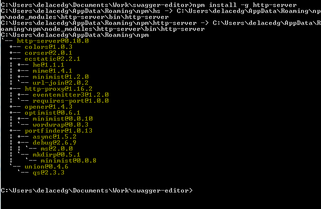
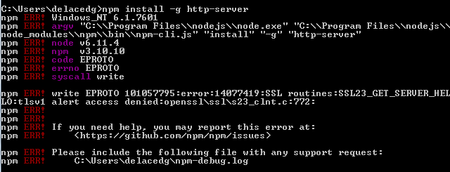
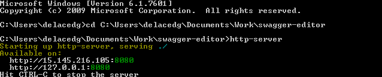

# Installing the Swagger Editor


The following instructions are for installing the Swagger Editor locally (in lieu of running in SwaggerHub).

- Download and install NodeJS from here: 
> https://nodejs.org/en/download

- Download Swagger Editor from here: 
> https://github.com/swagger-api/swagger-editor/releases/download/v2.10.4/swagger-editor.zip

- Unzip Swagger Editor to a location of your choice

- Install the NodeJS Http Server by executing the following from a command line: 
```
npm install -g http-server
```
  - After the command was executed if the installation was correct it should look like below screen.
      
 
  - If you get errors like the following screen it means that you need to set the https proxy.
      
 
  - To set up the proxy use the following command lines (substituting your proxy for the one listed here):
<br>
```
npm config set proxy http://proxy.nasa.omc.hp.com:8080
npm config set https-proxy http://proxy.nasa.omc.hp.com:8080 
```
<br>
  - Confirm they were set correctly by executing:
<br>
```
npm config get proxy
```
- To start Swagger Editor:
  - In a command window navigate to the folder where the Swagger Editor is
  - type http-server to run up the http-server with the content from the Swagger Editor folder
  - copy/paste any provided URL from the http-server start into your favorite browser.

      
 
*Note:* If you find the browser does not present Swagger Editor, you may find a reboot solves the issue!

